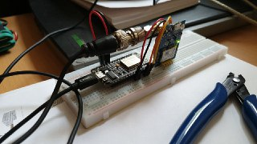

# esp8266 GPS APRS-IS Client with SmartBecon
GPS receiver that can send APRS position reports to an APRS-IS server. This client has also SmartBeacon(TM) capability.

## Hardware prerequisities
- An esp8266 board
- One GPS Sensor that can output NMEA

## Software prerequisities
- [InfluxDB](https://www.influxdata.com/) running somewhere in the internet
(or another software that can handle similar POST request).
- [Arduino IDE](https://www.arduino.cc/en/main/software)
- [Arduino ESP8266 filesystem uploader](https://github.com/esp8266/arduino-esp8266fs-plugin)
- [TinyGPS++ library](http://arduiniana.org/libraries/tinygpsplus/)

Required libraries:

ESP8266WiFi, ESP8266WiFiMulti,  ESP8266HTTPClient, WiFiClientSecure, WiFiClient, DNSServer, ESP8266WebServer, SoftwareSerial, FS

Use the filesystem uploader tool to upload the contents of data library. It contains the html pages for
the configuring portal.

## Connections
Connect your GPS receiver to pins D7 (RXD2) and D8 (TXD2). 

You can connect a switch between D1 and GND. If D1 is grounded, the esp8266 starts portal mode. The pin can be
also changed from the code, see row `#define APREQUEST PIN_D1`

## APRS configuration
Use the Portal mode to configure the APRS settings:
- Callsign to transmit as
- APRS passcode
- Comment text to send with beacon
- APRS-IS Server Hostname, use one of the rotated names for redundancy and balance on the hosts
- APRS Symbol, reference the APRS symbols table for the two character string
- [SmartBeacon(TM)](http://www.hamhud.net/hh2/smartbeacon.html) parameters

For the SmartBeacon(TM) parameters there are a number of sites explaining the algorythm and gives some hints on good sets depending if your are walking, on the bike or driving a car. 

Only valid position reports are transmitted and only when HDOP is non-zero and better than 10. (0 < HDOP < 10)

## Portal mode
When your board is in portal mode, it blinks both onboard LEDs. Take your phone and connect to WiFi network 
**ESP8266 APRS** and accept that there's no internet connection etc.

Open your browser and go to `http://192.168.4.1/`

The web GUI should be self explanatory.

There's almost no sanity checks for the data sent from the forms. This is not a public web service and if you
want to mess up your board or make a denial of service to it using eg. buffer overflows, feel free to do so.

Credits for the configuration portal mode goes to [Mikko](https://github.com/oh2mp/).

### Sample screenshots from the portal

