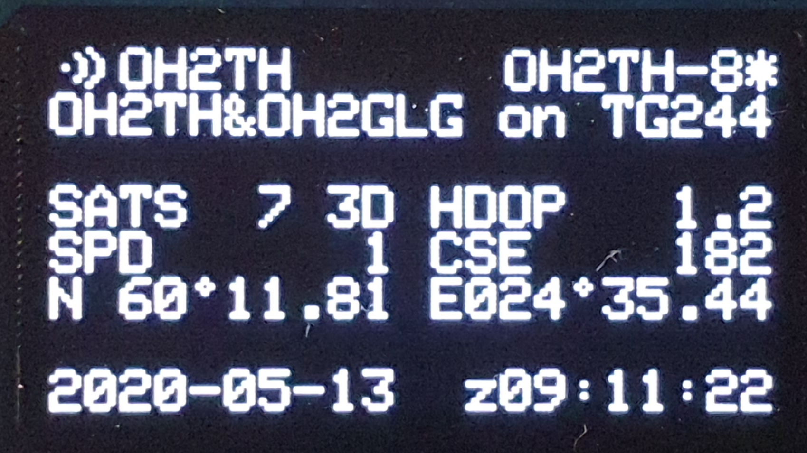
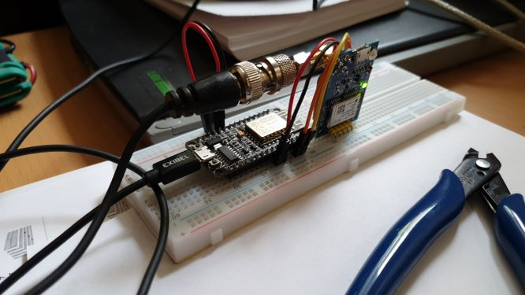
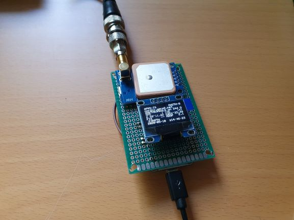
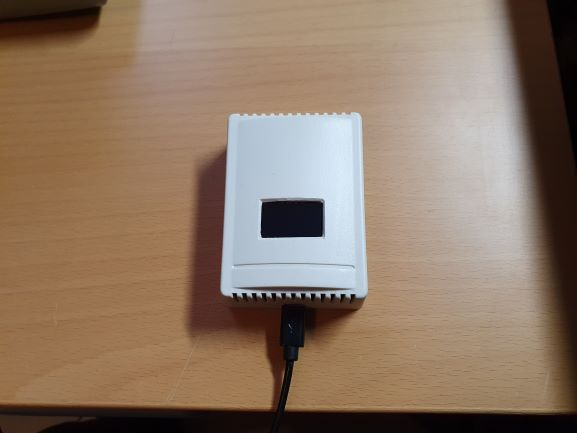
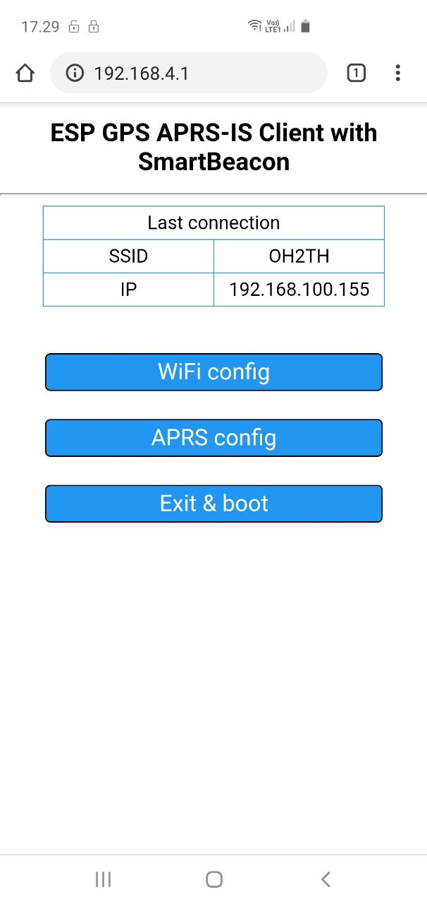

# ESP SmartBeacon APRS-IS Client
GPS receiver that can send APRS position reports to an APRS-IS server. This client has also SmartBeacon(TM) capability.

## Hardware prerequisities
- An esp8266 board
- One GPS Sensor that can output NMEA

## Software prerequisities
- [InfluxDB](https://www.influxdata.com/) running somewhere in the internet
(or another software that can handle similar POST request).
- [Arduino IDE](https://www.arduino.cc/en/main/software)
- [Arduino ESP8266 filesystem uploader](https://github.com/esp8266/arduino-esp8266fs-plugin)
- Download and install [TinyGPS++ library](http://arduiniana.org/libraries/tinygpsplus/)

Required libraries:

ESP8266WiFi, ESP8266WiFiMulti,  ESP8266HTTPClient, WiFiClientSecure, WiFiClient, DNSServer, ESP8266WebServer, SoftwareSerial, FS

Optional libraries:

Wire, Adafruit_SSD1306, Adafruit_GFX

Use the filesystem uploader tool to upload the contents of data library. It contains the files for
the configuration portal.

## Connections
Connect your GPS receiver to pins D7 (RXD2) and D8 (TXD2). 

You can connect a switch between D1 and GND. If D1 is grounded, the esp8266 starts portal mode. The pin can be
also changed from the code, see row `#define APREQUEST PIN_D5`.

Optionally you can connect an I2C OLED Display to D1 (SCL) and D2 (SDA) for live information display. 
You should change `#define SSD1306_128_64` to `#undef SSD1306_128_64` to disable the display code. If the display is not used,
the onboard LEDs will show the board operational status.
- Portal mode - alternating
- Operational - one is steady, the other one when sending to APRS-IS

## APRS configuration
Use the Portal mode to configure the APRS settings:
- Callsign to transmit as
- APRS passcode
- Comment text to send with beacon
- APRS-IS Server Hostname, use one of the rotated names for redundancy and balance on the hosts
- APRS Symbol, reference the APRS symbols table for the two character string
- [SmartBeacon(TM)](http://www.hamhud.net/hh2/smartbeacon.html) parameters

For the SmartBeacon(TM) parameters there are a number of sites explaining the algorythm and gives some hints on good sets depending if your are walking, on the bike or driving a car. 

Only valid position reports are transmitted and only when HDOP is non-zero and better than 10. (0 < HDOP < 10)

## Portal mode
When your board is in portal mode, it blinks both onboard LEDs. Take your phone and connect to WiFi network 
**ESP8266 APRS** and accept that there's no internet connection etc.

Open your browser and go to `http://192.168.4.1/`

The web GUI should be self explanatory.

There's almost no sanity checks for the data sent from the forms. This is not a public web service and if you
want to mess up your board or make a denial of service to it using eg. buffer overflows, feel free to do so.

Credits for the configuration portal mode goes to [Mikko](https://github.com/oh2mp/).

## Display
The optional display shows current information such as configuration, connectivity and runtime position.

|Wifi AP|mycall(*)|
|---|---|
|APRS comment|
|Number of satellites and Fix status|HDOP|
|Speed (km/h)|Course|
|Latitude|Longitude|
|date|time UT|

The (*) next to "mycall" shows if the last beacon was successfully sent to the selected APRS-IS server.

## Sending to your InfluxDB
You can also send gps data to an InfluxDB. These fieldkeys and values are sent.
- lat = latitude in decimal degrees
- log = longitude in decimal degrees
- cse = heading degrees from north
- spd = speed m/s
- alt = altitude in decimal meters
- mod = NMEA mode 1, 2 or 3
In the configuration portal you can configure the DB-connection information. You receive something like this in the database:
```
> select * from gps
name: gps
---------
time                    alt     call    cse     lat             lon             spd     tocall
1589354350350738663     20.8    OH2TH-8 0       60.196957       24.590744       0.1     APESPG
1589354491376787771     18.6    OH2TH-8 0       60.196991       24.590691       0       APESPG
1589354918331182449     12.1    OH2TH-8 219     60.196941       24.5907         0.6     APESPG
1589355020851526148     7.4     OH2TH-8 0       60.197033       24.590605       0.1     APESPG
```

## Some pictures of the device




## Sample pictures of the portal

