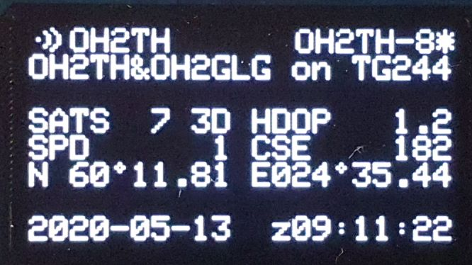

# ESP SmartBeacon APRS-IS Client
GPS receiver that can send APRS position reports to an APRS-IS server. This client has also SmartBeacon(TM) capability.

## Hardware prerequisities
- An esp8266 board
- One GPS Sensor that can output NMEA

## Software prerequisities
- [InfluxDB](https://www.influxdata.com/) running somewhere in the internet
(or another software that can handle similar POST request).
- [Arduino IDE](https://www.arduino.cc/en/main/software)
- [Arduino ESP8266 filesystem uploader](https://github.com/esp8266/arduino-esp8266fs-plugin)
- Download and install [TinyGPS++ library](http://arduiniana.org/libraries/tinygpsplus/)

Required libraries:

ESP8266WiFi, ESP8266WiFiMulti,  ESP8266HTTPClient, WiFiClientSecure, WiFiClient, DNSServer, ESP8266WebServer, SoftwareSerial, FS

Optional libraries:

Wire, Adafruit_SSD1306, Adafruit_GFX

Use the filesystem uploader tool to upload the contents of data library. It contains the files for
the configuration portal.

## Connections
Connect your GPS receiver to pins D7 (RXD2) and D8 (TXD2). 

You can connect a switch between D1 and GND. If D1 is grounded, the esp8266 starts portal mode. The pin can be
also changed from the code, see row `#define APREQUEST PIN_D5`.

Optionally you can connect an I2C OLED Display to D1 (SCL) and D2 (SDA) for live information display. 
You should change `#define SSD1306_128_64` to `#undef SSD1306_128_64` to disable the display code. If the display is not used,
the onboard LEDs will show the board operational status.
- Portal mode - alternating
- Operational - one is steady, the other one when sending to APRS-IS

# Operating the device

## Portal mode
When your board is in portal mode, it blinks both onboard LEDs. Take your phone and connect to WiFi network 
**ESP8266 APRS** and accept that there's no internet connection etc.

Open your browser and go to `http://192.168.4.1/`

The web GUI should be self explanatory.

There's almost no sanity checks for the data sent from the forms. This is not a public web service and if you
want to mess up your board or make a denial of service to it using eg. buffer overflows, feel free to do so.

Credits for the configuration portal mode goes to [Mikko](https://github.com/oh2mp/).

## APRS configuration
Use the Portal mode to configure the APRS settings:
- Callsign to transmit as
- APRS passcode
- Comment text to send with beacon
- APRS-IS Server Hostname, use one of the rotated names for redundancy and balance on the hosts
- APRS Symbol, reference the APRS symbols table for the two character string
- [SmartBeacon(TM)](http://www.hamhud.net/hh2/smartbeacon.html) parameters

For the SmartBeacon(TM) parameters there are a number of sites explaining the algorythm and gives some hints on good sets depending if your are walking, on the bike or driving a car. 

## InfluxDB
The device can also send position update to an InfluxDB. Enter portal mode to configure:
- The write URL to your InfluxDB database instance, leave empty or prefix any other character than 'h' to disable updates
- username:password for the database
- and the measurement name to store the data in

The data is update using fields:
- lat = latitude in decimal degrees
- log = longitude in decimal degrees
- cse = heading degrees from north
- spd = speed m/s
- alt = altitude in decimal meters
- mod = NMEA mode 1 - no fix, 2 - 2D fix or 3 - 3D fix
- dst = distance travelled in meters since last successful update

Update interval is tied to APRS SmartBeacon(TM). You should receive something like this in the database:

```
> select * from gps where time > 1596175233491768669
name: gps
time                alt  call    cse dst lat       lon       mod spd tocall
----                ---  ----    --- --- ---       ---       --- --- ------
1596176422383069336 9.5  OH2TH-8 0   0   60.090664 19.954121 3   0   APESPG
1596178223002983896 2.6  OH2TH-8 0   5   60.090675 19.954029 3   0   APESPG
1596180025649181609 5.2  OH2TH-8 226 6   60.09066  19.95401  3   0   APESPG
1596181829527106102 12.5 OH2TH-8 3   4   60.090698 19.954079 3   0.2 APESPG
1596183251438975396 4    OH2TH-8 309 5   60.090672 19.95402  3   0.6 APESPG
1596185053229894020 8.1  OH2TH-8 309 5   60.090694 19.954037 3   0   APESPG
```

## Display
The optional display shows current information such as configuration, connectivity and runtime position.


The fields in display are these, and of course you can customize it in the code.
```
Wifi AP                 mycall(*)
APRS comment

Num sats and Fix             HDOP
Speed (km/h)               Course
Latitude                Longitude 

date                      time UT
```

The (*) next to "mycall" shows if the last beacon was successfully sent to the selected APRS-IS server.

# Mode pictures and screenshots

## Some pictures of the device


## Sample pictures of the portal


# Disclaimer
The device was built to my own needs, and has only been tested in the northern hemisphere east of Greenwich, so negative coordinates may or may not work properly. This has also not been checked for memory leaks. Feel free to create an issue and I'll try to fix the code at some time, or not. Even better if you have a fix, let me know and I can import the fix.
